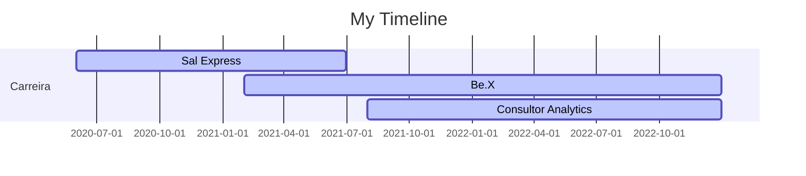

## Olá!! Eu sou o Júlio Zeferino

- 📊 Hoje trabalho com Business Intelligence e Analytics
- 🌱 Estudando Engenharia de Dados
- 👦 Pronouns: ele / dele

  
 ## Atuação profissional
  
 📊 CoFounder - Be.X (02.2022 - Atual)  
 
 📊 Head of Analytics - Sal Express Soluções Logísticas (01.2021 - 06.2022)
  
  ## Formação Acadêmica
  
:newspaper_roll: Especialização em Engenharia de Dados - PUC (2022 - 2023)

:newspaper_roll: Bacharel em Ciencia e Economia - UNIFAL (2018 - 2021)

:newspaper_roll: Técnico em Administração - IFSULDEMINAS (2017 - 2018)   

##

  <a href="https://github.com/julioszeferino">
  
  

 
  
  
  
  
  
  

  
  ##
 

 
  
  
  
   
 
   

  
