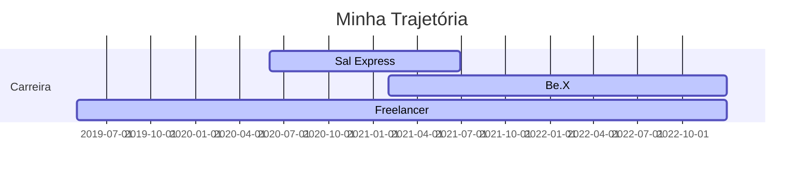

# Olá!! Eu sou o Júlio Zeferino

- 📊 Hoje trabalho como Product Manager em Projetos de Analytics
- 🌱 Estudando Engenharia de Dados
- 👦 Pronouns: ele / dele

  
## Atuação profissional
  
📊 Product Manager - Be.X (02.2021 - Atual) 

📊 Freelancer - Workana (05.2019 - Atual) 
 
 
📊 Head of Analytics | BI Project Leader - Sal Express Soluções Logísticas (01.2021 - 06.2022)

  
## Formação Acadêmica
  
:newspaper_roll: Especialização em Engenharia de Dados - PUC/MG (2022 - 2023)

:newspaper_roll: Bacharel em Ciencia e Economia - UNIFAL (2018 - 2021)

:newspaper_roll: Técnico em Administração - IFSULDEMINAS (2017 - 2018)   

## Portfólio de Projetos
[Dashboards](https://github.com/julioszeferino/dashboards)  
[Modelagem de Banco de Dados Relacional](https://github.com/julioszeferino/banco_dados_relacional)  
[Modelagem de Banco de Dados Dimensional](https://github.com/julioszeferino/banco_dados_dimensional)  
[Crawler Microdados ENEM](https://github.com/julioszeferino/crawler_enem)  
[Pipeline de Dados](https://github.com/julioszeferino/pipeline_dados)  
[Data Lakehouse](https://github.com/julioszeferino/data_lakehouse)  
[Streaming de Dados com o AWS Kinesis](https://github.com/julioszeferino/streaming_kinesis)  

## Publicações e Participações em Eventos

[Bate Papo com o Egresso - Unifal MG](https://www.youtube.com/watch?v=YG-65-kyqNA)  
[O que é a Engenharia de Dados? - Blog Voitto](https://voitto.com.br/blog/artigo/o-que-e-engenharia-de-dados)  
[Business Process Outsourcing: o que é e como implantar no seu negócio! - Blog Voitto](https://voitto.com.br/blog/artigo/bpo)  
[Entenda como funciona a Automação Robótica de Processos! - Blog Voitto](https://voitto.com.br/blog/artigo/rpa) 

##

  <a href="https://github.com/julioszeferino">
  
  

 
  

  

  
  ##
 

 
  
  
  
   
 
   

  
